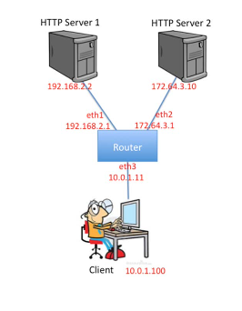

# csc2209_pa1 - Simple Router
## Introduction
This is a a simple router with a static routing table. The router receives raw Ethernet frames. It will process the packets just like a real router, then forward them to the correct outgoing interface. The main function of this project is to create the forwarding logic so packets go to the correct interface.  
The router will route packets from an emulated host (client) to two (2) emulated application servers (HTTP Server 1 and 2) sitting behind your router. The application servers are each running an HTTP server. A sample routing topology is show below:  
  
the following operations should work:  
Pinging from the client to any of the router's interfaces (192.168.2.1, 172.64.3.1, 10.0.1.11).  
Tracerouting from the client to any of the router's interfaces  
Pinging from the client to any of the app servers (192.168.2.2, 172.64.3.10)  
Tracerouting from the client to any of the app servers  
Downloading a file using HTTP from one of the app servers
